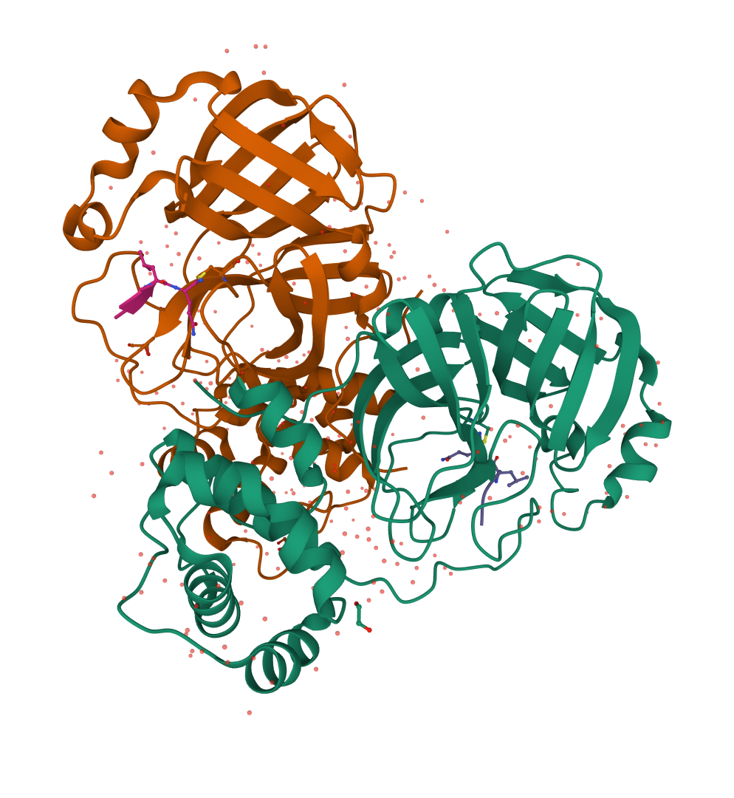
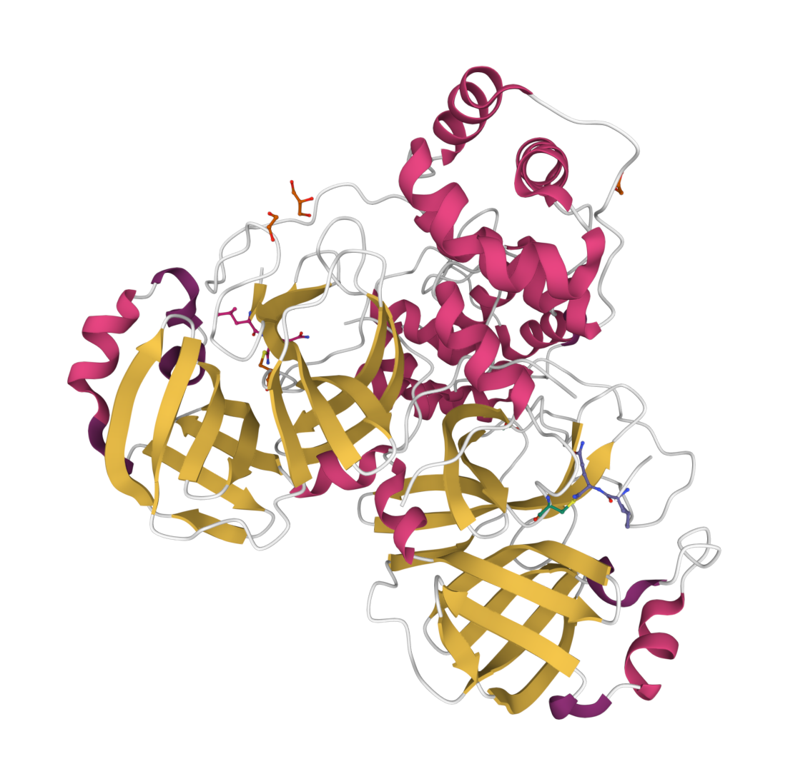
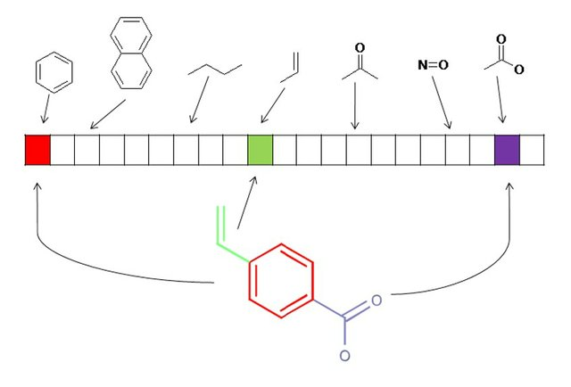

# **Computational Drug Discovery with ML**
This is a repository for a Machine Learning project targeted towards Computational Drug Discovery applications. We start with selecting for a specific target protein for the drugs imported from ChEMBL Database. Getting All drugs activity data for the specific target, then calculating PaDEL molecular Descriptors for the the Substructure Molecular Fingerprints in each. Using the substructure fingerprints data as feature vectors for all drug molecules, we train a Random Forest Classifier and an SVM Classifier to predict drug activity class to see if it could be a potential drug for our selected target.
For our study, I selected the **_SARS coronavirus 3C-like proteinase_** (PDB ID:[3VB7](https://www.rcsb.org/structure/3vb7)) which hydrolyses viral polyproteins to produce functional proteins, is essential for coronavirus replication and is considered an important therapeutic target for diseases caused by coronaviruses, including COVID-19.   

## **Padel-Descriptors**
### **Molecular Descriptors**
Molecular descriptors can be defined as *__mathematical representations of molecules' properties that are generated by algorithms__*. The numerical values of molecular descriptors are used to quantitatively describe the physical and chemical information of the molecules.   
### **Molecular Fingerprints**
Molecular fingerprints are **_a way of encoding the structure of a molecule._** The most common type of fingerprint is a series of binary digits (bits) that represent the presence or absence of particular substructures in the molecule.   

     

### **PaDEL**
A software to calculate molecular descriptors and fingerprints. The software currently calculates 1875 descriptors (1444 1D, 2D descriptors and 431 3D descriptors) and 12 types of fingerprints (total 16092 bits). The descriptors and fingerprints are calculated using The Chemistry Development Kit with additional descriptors and fingerprints such as atom type electrotopological state descriptors, Crippen's logP and MR, extended topochemical atom (ETA) descriptors, McGowan volume, molecular linear free energy relation descriptors, ring counts, count of chemical substructures identified by Laggner, and binary fingerprints and count of chemical substructures identified by Klekota and Roth.   

### **PaDELPy**
**PaDELPy** provides a Python wrapper for the PaDEL-Descriptor molecular descriptor calculation software. It was created to allow direct access to the PaDEL-Descriptor command-line interface via Python.    

